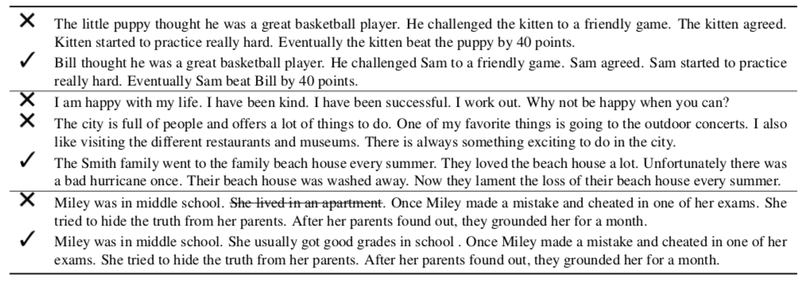
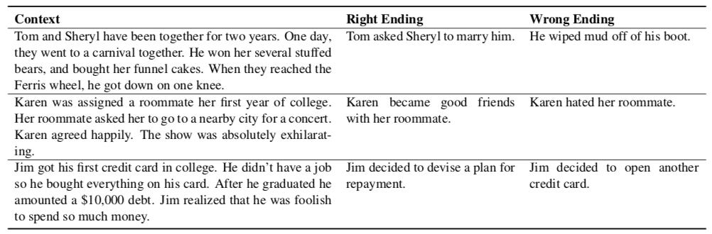
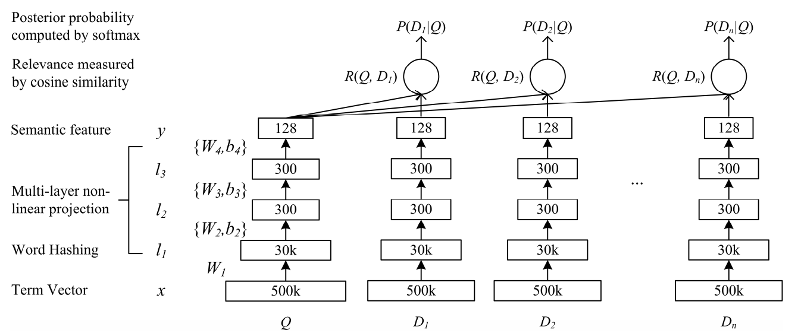

# ROCStories and Story-Cloze-Test(SCT) Analysis

Analysis on ROCStories and related SCT task with its history, developments and future works. We focus on the crowd-sourcing details, previous frameworks and unsolved problems.

Contributed by Yuqiang Xie, National Engineering Laboratory for Information Security Technologies, IIE, CAS.

## Introduction

Firstly, Mostafazadeh et al. (2016) proposed ROCStories dataset, which is a collection of crowd-sourced complete five sentence stories through Amazon MTurk. With a theme, each Story follows a character through a fairly simple series of events to a conclusion. We usually call the first four sentences 'plot', and the last one 'ending'. To some degree, it can be an unlabeled source with no negative sample. The prompt to the crowd-sourcing is the following points:

**The prompt of ROCStories**

Imagine that you want to tell a five-sentence story to your friend. It can be about something that happened, something you or someone else has experienced in the past, or simply any life story about someone or something. Your task is to write this five-sentence story. Your should have all of the following five properties:
* Your story should be entirely realistic;

* Your story should read like a coherent story, with a specific beginning and end, where something happens in between. This constraint resulted in many casual and temporal links between the events.

* Each sentence in your story should be logically related to the next sentence and be about the characters of the story.

The below pic is some examples from ROCStories crowd-sourcing:

    

There are three main tasks about ROCStories: *1, story cloze test (SCT); 2, story generation; 3, knowledge extraction and narrative structure learning.* We focus on the first one and will research on the next two. 

Based on ROCStories, Mostafazadeh et al. (2016) also introduced **SCT** evaluation framework and built development set and test set to address the lack of evaluation framework and datasets on which story comprehension model can be trained and tested. The motivation is that model is trained on ROCStories and evaluated on SCT. Dev set and test set were crowd-sourced by producing two related endings for the plot. In other words, every plot has two endings, and label is the index of the more appropriate ending. Model must choose the correct ending to the story **which is trained by ROCStories**.

**The prompt of SCTv1.0**

You are given a sequence of four sentences, which together form a coherent four-sentence story. Your task is to write the fifth sentence which is an ending to the story in two ways:
* 'right ending': that naturally ends the story in a coherent and meaningful way.

* 'wrong ending': that is entirely **impossible** to be a correct/natural ending to the story. That is, if you add this fifth sentence to the four sentences it would not make sense as a meaningful story.

**Besides:**

* All endings should follow up the story by sharing at least one of the characters of the story.

* All endings should be meaningful and realistic when you read it on its own.

The below pic is some examples from SCTv1.0 crowd-sourcing:

    

Recently, many works proposed a problem: SCTv1.0 may be an easier task than identifying whether a given ending is coherent or not. Also, they (Cai et al. 2017; Srinivasan et al. 2018) got roughly the same accuracy by only using the endings to do a binary classification. Maybe, the prompt of SCTv1.0 has some problems. To address this issue, Sharma et al. proposed SCTv1.5 which have the following new characters to shed human-authorship biases:

**The prompt of SCTv1.5**

* The new endings ['right' or 'wrong'] should
    * contain a similar number of tokens;
    * have similar distributions of token n-grams and char-grams;
    * occur as standalone events with the same likelihood to occur, with topical, sentimental, or emotion consistencies when applicable.

**Two Methods to achieve the prompt:**

***Method #1***
* write 'right' and 'wrong' ending for the first four sentences
    * each sentence should stay within the same subject area of the story;
    * The number of words in two endings should not differ by more than two words;
    * When possible, two endings should try to keep a similar tone/sentiment as one another.

***Method #2***
* modify the fifth sentence ('right' ending) to the 'wrong' ending
    * 'right ending' is from five sentences stories;
    * should make sense standalone;
    * can not differ in the number of words from original sentence by more than three words;
    * can not use 'not' in front of a description or a verb.

The below is some examples from SCTv1.5 dev set:

1. Rick grew up in a troubled household.,"He never found good support in family, and turned to gangs.",It wasn't long before Rick got shot in a robbery.,The incident caused him to turn a new leaf.,He is happy now.,He joined a gang.,1
2. Laverne needs to prepare something for her friend's party.,She decides to bake a batch of brownies.,She chooses a recipe and follows it closely.,Laverne tests one of the brownies to make sure it is delicious.,The brownies are so delicious Laverne eats two of them.,Laverne doesn't go to her friend's party.,1
3. Sarah had been dreaming of visiting Europe for years.,She had finally saved enough for the trip.,She landed in Spain and traveled east across the continent.,She didn't like how different everything was.,Sarah then decided to move to Europe.,Sarah decided that she preferred her home over Europe.,2

With the development on SCTv1.5, we can see the biases in the endings would be reduced to some degree. The following is the analysis on standard deviation of the word and character n-gram counts, as well as the part of speech (POS) counts, between the right and wrong endings:

|Version| N-gram | Char n-gram  | POS | 
| :---: | :---: | :---: | :-----: | 
|SCTv1.0| 13.9   | 12.4   |    16.4 |   
|SCTv1.5| 7.0 | 6.3 |7.5|

## Previous Approaches

Focus on neural network models which had been proved more powerful than classical ways.

### Comparison

|Model| Time | Org. | Feature| ROCStories |Commonsense|SCTv1.0 | SCTv1.5 | 
| :--- | :---: | :------ | :-----: | :-----: | :-----: | :-----: |:-----: |
|  [DSSM](#DSSM) | 2013  | MSR  |  No |  Yes | No | 58.5% | -  | 
|  [msap](#msap) |  2017 | UW  |  Yes |  Yes | No |  75.2% |   |
|  [cogcomp](#cogcomp) |  2017 |  UI |  Yes |  Yes | No | 77.6%  | 60.8%  |
|  [EndingReg](#EndingReg) | 2018  | UR | Yes  |  Yes | No | 71.5%  |  64.4% |
|  [val-LS-skip](#val-LS-skip)|  2018 |  GIT |  No | No | No  |  76.5% |   |
|  [GPT](GPT) |  2018 |  OpenAI |  No |  No |  No |  86.5% | - |
|  [GPT+ConceptNet](GPT+ConceptNet) |  2018 |  ZU |  No | Yes |  Yes |  87.6% | - |
|  [GPT+GRS](GPT+GRS) |  2018 |  CMU |  No | No  |  No |  88.3% | - |

### DSSM
**Learning deep structured semantic models for web search using clickthrough data.** *Po-Sen Huang, Xiaodong He, Jianfeng Gao, Li Deng, Alex Acero, and Larry Heck.* In CIKM, 2013. ***Org: Microsoft Speech Research.*** [ [pdf](http://delivery.acm.org/10.1145/2510000/2505665/p2333-he.pdf?ip=159.226.95.66&id=2505665&acc=ACTIVE%20SERVICE&key=33E289E220520BFB%2E99E4F0382D256DD3%2E4D4702B0C3E38B35%2E4D4702B0C3E38B35&__acm__=1553060575_4b10be256b9b9a6cd55b3290fc76e605) ]

* Implement details: two feed-forward neural networks trained jointly on ROCStories to project the four-sentences context and the right fifth sentence into the same vector space. 

* This model had outperformed all the other baselines reported in Mostafazadeh et al. (2016). So, it is also called 'ROCNLP' baseline.

* **Overview**
    

        
    

### msap
**Story Cloze Task: UW NLP System.** *Roy Schwartz, Maarten Sap, Ioannis Konstas, Leila Zilles1, Yejin Choi and Noah A. Smith.* In workshop of ACL, 2017. ***Org: University of Washington.*** [ [pdf](http://www.aclweb.org/anthology/W/W17/W17-0907.pdf) ]

* Implement details: linear classifier based on language modeling probabilities of the entire story.

* Add the linguistic features of only the ending sentences. These ending “style” features include sentence length as well as word and character n-gram in each candidate ending (independent of story).

### cogcomp
**Story Comprehension for Predicting What Happens Next.** *Snigdha Chaturvedi, Haoruo Peng, Dan Roth.* In EMNLP, 2017. ***Org: University of Illinois.*** [ [pdf](http://aclweb.org/anthology/D17-1168) ]

* Implement details: linear classification system that measures a story’s coherence based on the sequence of events, emotional trajectory, and plot consistency. 

* This model takes into account frame-based and sentiment-based language modeling probabilities as well as a topical consistency score.

### EndingReg
**Tackling the Story Ending Biases in The Story Cloze Test.** *Rishi Sharma, James F. Allen, Omid Bakhshandeh, Nasrin Mostafazadeh.* In ACL, 2018. ***Org: University of Rochester.*** [ [pdf](http://www.aclweb.org/anthology/W/W17/W17-0907.pdf) ]

* Implement details: for each ending, it created the following features from the whole five-sentence story:
    1. Number of tokens
    2. VADER composite sentiment score 
    3. Yngve complexity score
    3. Token-POS n-grams
    4. POS n-grams
    5. Four length character-grams

* It aims to find out the most biased features.

* To overcome the biases from endings in SCTv1.0, this work built new SCTv1.5 dataset which focused on N-grams features. It makes the SCT task more difficult to some degree.

### val-LS-skip
**A Simple and Effective Approach to the Story Cloze Test.** *Siddarth Srinivasan, Richa Arora, Mark Riedl.* In NAACL, 2018. ***Org: Georgia Institute of Technology.*** [ [pdf](https://arxiv.org/pdf/1803.05547.pdf) ]

* Present a simpler fully-neural approach to the Story Cloze Test using skip-thought embeddings of the stories in a feed-forward network.

* Only use dev set to train model.

* **Overview**
    

        
    

### GPT
**Improving Language Understanding by Generative Pre-Training.**

### GPT+ConceptNet
**Incorporating Structured Commonsense Knowledge in Story Completion.**

### GPT+GRS
**Improving Machine Reading Comprehension with General Reading Strategies.**

